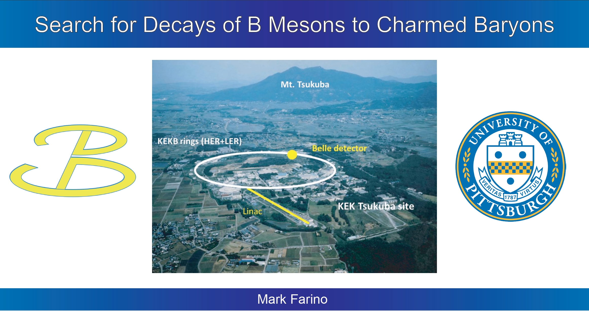

[Download slides](https://github.com/mfarino64/Slides/raw/main/Thesis_slides_Farino.pdf)

This is my thesis defense to earn the Bachelor of Philosophy (BPhil) degree from the University of Pittsburgh Honors College. I presented the culmination of my undergraduate work with <a href = "https://www.physicsandastronomy.pitt.edu/people/vladimir-savinov" target="_blank">Professor Vladimir Savinov</a> on the <a href="https://belle.kek.jp/" target="_blank">Belle Experiment</a>. You can see my thesis in full <a href="http://d-scholarship.pitt.edu/42680/" target="_blank">here</a> or click the image below to watch the defense at your leisure.

